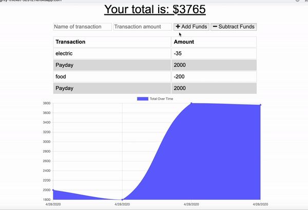

# Budget-Tracker (Homework Assignment for PWA)

## Purpose

The purpose of this assignment is develop an app that logs information into mongoDB while online or offline.  In this example we are provided starter code which included a models folder containing the `transaction.js` file.  We also were provided a public folder containing a sub folder, icons containing the two png files.  In the public folder it contained the following files `index.html` , `index.js` , `styles.css`.  Starter code also included the routes folder containing the `api.js`.  a `package.json` and `server.js` were in the root.

## Functionality

The app takes in additions and subtractions into a total budget.  The information will generate a chart showing the the addtions and subtractions to the budget.  The app will work online as well as offline.  When offline, upon coming backonline information will update from the indexedDB on your local.

## User Story
AS AN avid traveller
I WANT to be able to track my withdrawals and deposits with or without a data/internet connection
SO THAT my account balance is accurate when I am traveling

## Business Context

Giving users a fast and easy way to track their money is important, but allowing them to access that information anytime is even more important. Having offline functionality is paramount to our applications success.

## Development

After being provided starter code, a `manifest.webmanifest` was added into the public file. Code was placed into this file.  The `manifest.webmanifest` is used in the development of PWAs and provides information regarding the web application in JSON format. This file is linked to the `index.html` as an link.  This can be tested within the browser by opening up the inspector and viewing under the application tab.

A `db.js` file was created under the public folder.  This file contains code which creates and writes to the database.  Comments in code to provide further notes to functionality.

A `server-worker.js` file is created and placed under the public folder as well. This file which runs in the background, separate from the web page.  It allows information to cached so that if you are offline, when you come online the information can be accessed for updates. A script will be required in the index.html to allow for functionality.

The `favicon.ico` was added to the public folder.  The `favicon.ico` provides a graphical representation of the site and can be seen in the address bar.

## Deployment

The provided `package.json` contained dependencies which could be accessed by runing `npm install`.
A database is set up via mongoDB.  The app is deployed to Heroku, supplementals for deployment provided within the supplemental.  

The deployed Heroku site can be found at:

[Heroku](https://mighty-thicket-32912.herokuapp.com/)

---
© 2019 Trilogy Education Services, a 2U, Inc. brand. All Rights Reserved.